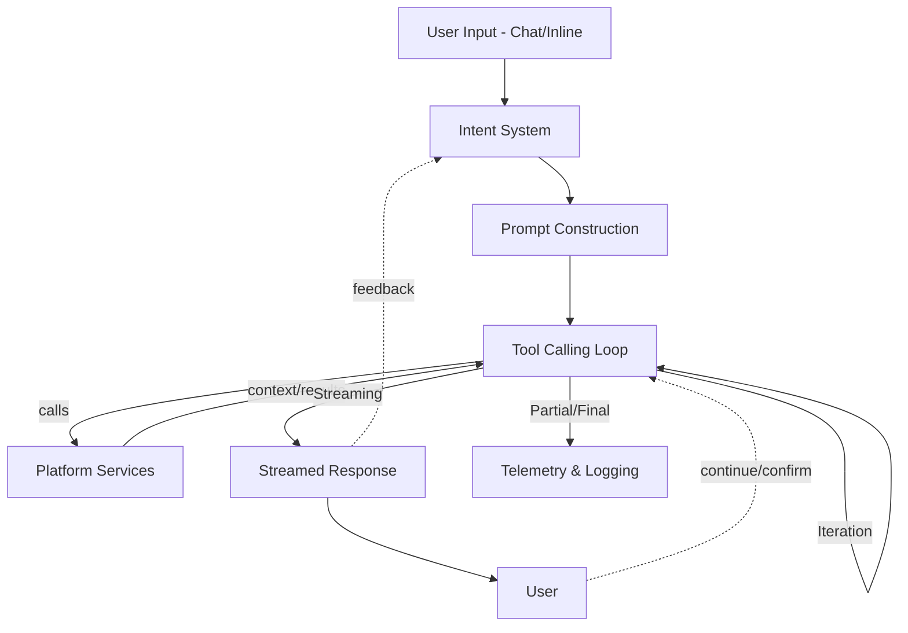

# Core Architecture

This document outlines the core architecture of the Copilot Chat extension, including its main layers and data flow. Each section links to a more detailed breakdown.

---

## Main Layers
- [Extension Host Layer](./extension-features.md)
- [Platform Services Layer](./platform-services.md)
- [Prompt & Intent System](./prompt-intent-system.md)
- [Tool Integration](./tool-integration.md)

---

## Data Flow
// #region context
//   const isContinuation = isToolCallLimitAcceptance(this.options.request) || isContinueOnError(this.options.request);
// #endregion
- User input is received via the chat interface or inline chat.
- The intent system determines the user's goal and orchestrates prompt construction.
- The tool calling loop manages autonomous agent actions and tool invocations.
- Platform services provide context, search, and workspace analysis.
- Results are streamed back to the user, with telemetry and logging throughout.

---

## Visual Data Flow (Mermaid)

---

Next: [Extension Features](./extension-features.md)
