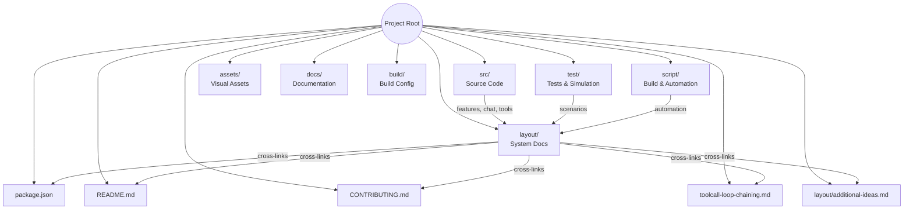

# File/Folder Map

This document provides a high-level map of the main files and folders in the Copilot Chat repository, with descriptions and cross-links to relevant documentation for each major area.

---

## Visual File/Folder Map (Mermaid)

---

## Key Files
- `package.json` — Project manifest and scripts.
- `README.md` — Project overview and getting started.
- `CONTRIBUTING.md` — Contribution guidelines.
- `toolcall-loop-chaining.md` — In-depth documentation of the tool calling loop. See [Tool Integration](./tool-integration.md).

---

## Directory Details
- **src/extension/** — Main extension features, chat system, prompt/intent logic, tool integration. See [Extension Features](./extension-features.md) and [Prompt & Intent System](./prompt-intent-system.md).
- **src/platform/** — Shared platform services (search, context, telemetry, etc.). See [Platform Services](./platform-services.md).
- **src/util/** — Common utilities and abstractions.
- **test/** — Unit, integration, and simulation tests. See [Testing & Simulation](./testing-simulation.md).
- **script/** — Automation and simulation scripts. See [Development Workflow](./development-workflow.md).

---

For more details, follow the links in this folder or see the [Overview](./overview.md).

---

Next: [Overview](./overview.md)
