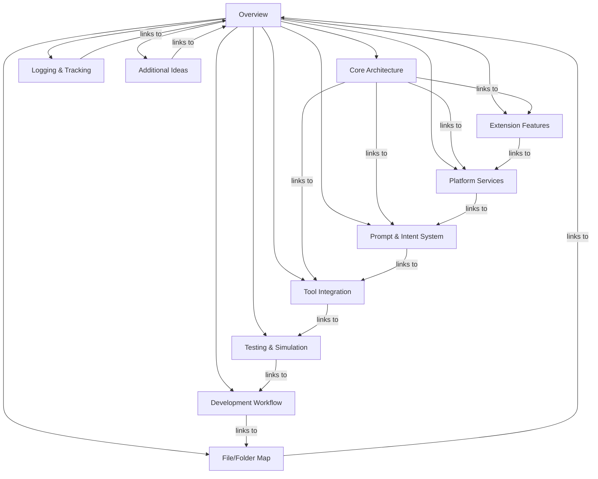

# Copilot Chat System Layout: Overview

This document provides a high-level overview of the Copilot Chat extension for Visual Studio Code. It serves as the entry point for a series of markdown files that describe the architecture, major components, and flow of the project. Each section links to a more detailed breakdown in a dedicated file.

---

---

## Visual Layout (Mermaid Flowchart)

---

## How to Use This Layout
- Start here for a bird's-eye view of the project.
- Follow links to drill down into specific areas.
- Each file is a living document and will be updated as the project evolves.
- See [Logging & Tracking](./logging-tracking.md) for a record of documentation progress and future update plans.

---

Next: [Core Architecture](./core-architecture.md)
