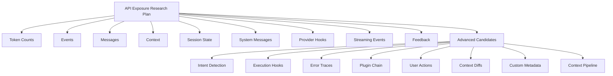

# API Exposure Research Overview

This folder contains research, proposals, and rationale for exposing internal chat and LLM APIs to extensions and advanced users. The goal is to enable automation, observability, and fine-grained control over the chat experience in VS Code.

## Visual Overview

## Contents

- **plan.md** — Research plan, objectives, and methodology
- **token-counts.md** — Exposing token usage for analytics and cost control
- **events.md** — Chat event APIs for real-time integrations
- **messages.md** — Access to message objects for custom UIs and analytics
- **context.md** — Context object exposure for context-aware extensions
- **session-state.md** — Session state APIs for workflow and analytics
- **system-messages.md** — System message and prompt engineering APIs
- **provider-hooks.md** — Provider registration and lifecycle management
- **streaming-events.md** — Streaming/partial message event APIs
- **feedback.md** — User feedback and ratings APIs
- **advanced-candidates.md** — Brainstormed advanced/experimental API ideas
- **intent-detection.md** — Intent detection results for automation
- **execution-hooks.md** — Pre/post message execution hooks
- **error-traces.md** — Error traces and diagnostics APIs
- **plugin-chain.md** — Plugin/agent chain state APIs
- **user-actions.md** — User action logs for analytics and automation
- **context-diffs.md** — Context diff APIs for context-aware automation
- **custom-metadata.md** — Custom metadata attachment APIs
- **context-pipeline.md** — Fine-grained context pipeline control for prompt engineering

## How to Use
- Each file documents a candidate API/data point, with rationale, use cases, risks, and proposed exposure mechanisms.
- Use this folder as a reference for prioritizing, designing, or discussing API exposure in the chat/LLM ecosystem.

---

_Last updated: July 18, 2025_
